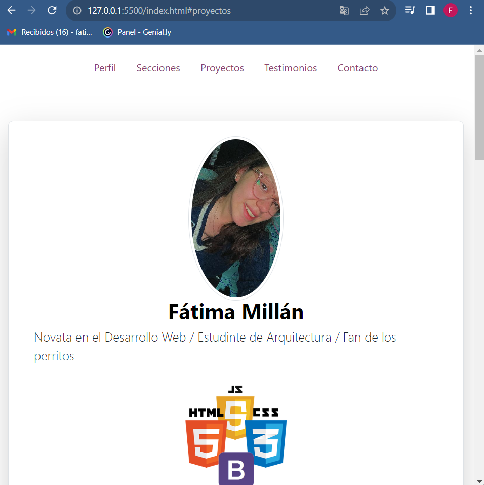
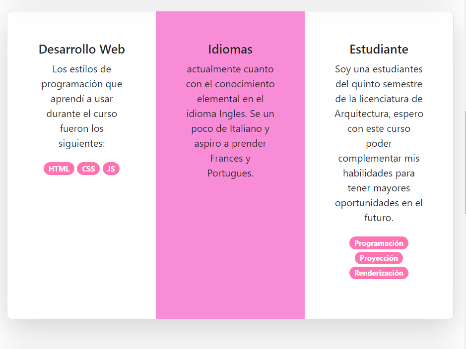
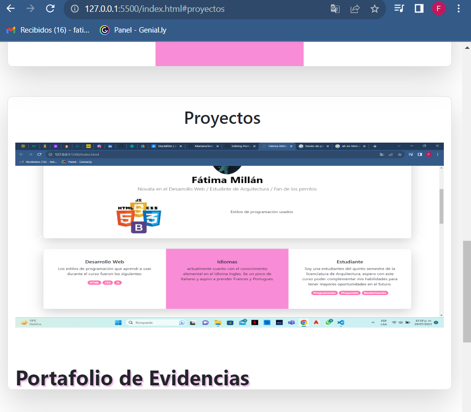

# Portafolio Responsivo con Bootstrap 5 #

El presente proyecto es creado para el bootcamp de **Tecnolochicas Pro Summer Camp.**

Es una página web responsiba *(adaptable a diversos tamaños de pantalla).*

El propósito del sitio web es mostrar el portafolio de proyectos de una desarrolladora y su experiencia.

Incluye una descripción de su motivación, experiencia, proyectos, articulos públicados y su forma de contacto.

Tambien contiene una sección de almacenamiento  de archivos *(imágenes)* que nos permiten modificar la imagen de perfil del desarrollador y contiene una animación desarrollada con JavaScript.
## Demo 
Aquí podras apreciar un poco de lo que puedes lograr con tu portafolio de evidencias, e incluso más si te lo propones.

te dejo uno ejemplo de lo que hice con el mio.
 
 
 

## Tecnologías

Esta página fe creada con:

* html 5
* css 3
* javascript
* Bootstrap 5

Además se incluyen *Google Fonts*

# Español
El texto de la página web esta escrito en español sin embargo las clcases relacionadas con Bootstrap se incluyen en ingles.

## Contacto 

Desarrollado por: Fátima Millán en Tecnolochicas Pro Summer Camp 
[Fátima Millán] (https://www.linkedin.com/in/f%C3%A1tima-mill%C3%A1n-3a2670267)
